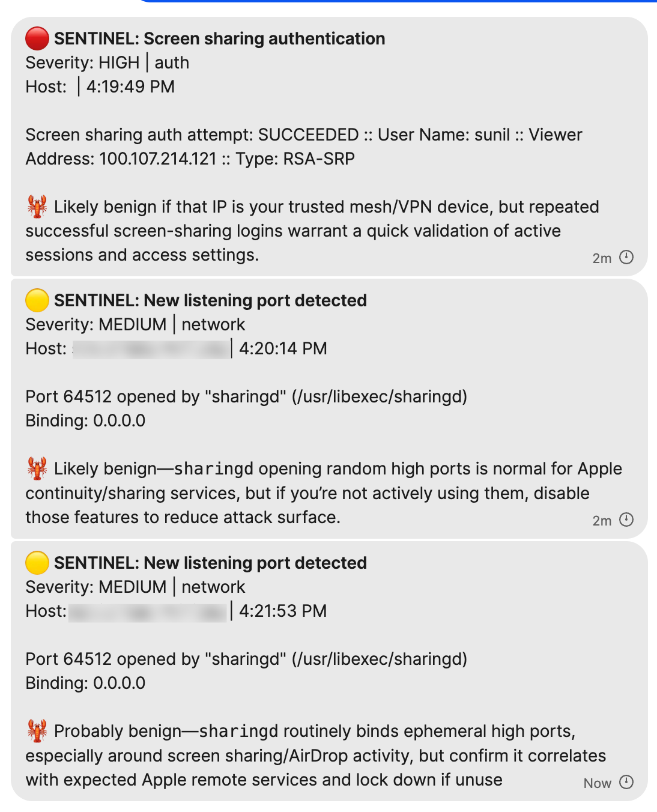

# 🛡️ OpenClaw Sentinel

<p align="center">
  
</p>

OpenClaw agents run with elevated privileges on your machine — shell access, file operations, network connections. Sentinel continuously monitors for unauthorized access, suspicious processes, privilege escalation, and system anomalies, alerting you in real-time through any OpenClaw channel.

A security monitoring plugin for [OpenClaw](https://github.com/openclaw/openclaw), powered by [osquery](https://github.com/osquery/osquery).

## What it does

Sentinel watches your machine for suspicious activity and alerts you in real-time:

- **🔍 Process monitoring** — unsigned binaries, privilege escalation, suspicious commands
- **🔐 SSH monitoring** — logins from unknown hosts, brute force attempts
- **🌐 Network monitoring** — new listening ports, unexpected services
- **📁 File integrity** — changes to critical system files, new persistence mechanisms (LaunchDaemons, cron)
- **🚨 Smart alerting** — learns your baseline (known hosts, ports) and only alerts on anomalies

## Architecture

```
┌─────────────────────────┐    ┌──────────────────────┐
│  Log Stream Watchers    │    │  osqueryd (root)      │
│  • system.log tail      │    │  • process events     │
│  • log stream (auth,    │    │  • port monitoring    │
│    screen sharing,      │    │  • crontab changes    │
│    user accounts)       │    │  • file integrity     │
└──────────┬──────────────┘    └──────────┬───────────┘
           │ logEvent()                    │ logEvent()
           ▼                               ▼
    ┌─────────────────────────────────────────┐
    │         events.jsonl (audit log)        │
    └──────────────────┬──────────────────────┘
                       │ fs.watch (tailed by)
                       ▼
              ┌─────────────────┐
              │   AlertTailer   │
              │  • threshold    │
              │  • dedup        │
              │  • suppression  │
              │  • clawAssess 🦞│
              └────────┬────────┘
                       ▼
              OpenClaw → Signal/Slack/Telegram
```

Sentinel **does not** run osqueryd itself (it requires root). You start osqueryd separately via `sudo` or `launchd`, and Sentinel tails its result logs.

## Prerequisites

- **macOS** (Apple Silicon or Intel) or **Linux** (systemd-based)
- [osquery](https://github.com/osquery/osquery) installed
- [OpenClaw](https://github.com/openclaw/openclaw) running

### Install osquery

**macOS (Homebrew):**
```bash
brew install --cask osquery
```

**macOS (manual):**
```bash
# Download the official .pkg from https://osquery.io/downloads
```

> **Note:** osquery needs **Full Disk Access** on macOS for the Endpoint Security framework. Grant it to `/opt/osquery/lib/osquery.app/Contents/MacOS/osqueryd` in System Settings → Privacy & Security → Full Disk Access.

**Linux (Debian/Ubuntu):**
```bash
wget -qO - https://pkg.osquery.io/deb/pubkey.gpg | sudo gpg --dearmor -o /usr/share/keyrings/osquery-archive-keyring.gpg
echo "deb [signed-by=/usr/share/keyrings/osquery-archive-keyring.gpg] https://pkg.osquery.io/deb deb main" | sudo tee /etc/apt/sources.list.d/osquery.list
sudo apt-get update && sudo apt-get install osquery
```

**Linux (RHEL/CentOS):**
```bash
curl -L https://pkg.osquery.io/rpm/GPG | sudo tee /etc/pki/rpm-gpg/RPM-GPG-KEY-osquery
sudo yum-config-manager --add-repo https://pkg.osquery.io/rpm/osquery-s3-rpm.repo
sudo yum install osquery
```

## Installation

### From npm (recommended)

```bash
npm install -g openclaw-sentinel
```

Then add the plugin to your `~/.openclaw/openclaw.json`:

```json
{
  "plugins": {
    "entries": {
      "sentinel": {
        "enabled": true,
        "module": "openclaw-sentinel",
        "config": {
          "alertChannel": "signal",
          "alertTo": "+1234567890",
          "alertSeverity": "high",
          "clawAssess": true
        }
      }
    }
  }
}
```

Restart your gateway:

```bash
openclaw gateway restart
```

### From source (development)

```bash
git clone https://github.com/sunil-sadasivan/openclaw-sentinel.git
cd openclaw-sentinel
npm install && npm run build
openclaw plugins install .
openclaw gateway restart
```

## Configuration

Add to your `~/.openclaw/openclaw.json` under `plugins.entries`:

```json
{
  "plugins": {
    "entries": {
      "sentinel": {
        "enabled": true,
        "config": {
          "osqueryPath": "/opt/osquery/lib/osquery.app/Contents/MacOS/osqueryi",
          "logPath": "~/.openclaw/sentinel",
          "alertChannel": "signal",
          "alertTo": "+1234567890",
          "alertSeverity": "high",
          "clawAssess": true
        }
      }
    }
  }
}
```

### Config options

| Option | Type | Default | Description |
|--------|------|---------|-------------|
| `osqueryPath` | string | auto-detect | Path to `osqueryi` binary |
| `logPath` | string | `~/.openclaw/sentinel` | Directory for sentinel data and osquery logs |
| `alertChannel` | string | — | Channel for alerts (`signal`, `slack`, `telegram`, etc.) |
| `alertTo` | string | — | Alert target (phone number, channel ID, etc.) |
| `alertSeverity` | string | `high` | Minimum severity to alert: `critical`, `high`, `medium`, `low`, `info` |
| `clawAssess` | boolean | `false` | Enable 🦞 Claw assessment — each alert gets a one-line LLM analysis via your OpenClaw agent, providing context on whether the event is benign or genuinely suspicious |
| `trustedSigningIds` | string[] | `[]` | Code signing IDs to skip (e.g. `com.apple`) |
| `trustedPaths` | string[] | `[]` | Binary paths to skip (e.g. `/usr/bin`, `/opt/homebrew/bin`) |
| `watchPaths` | string[] | `[]` | File paths to monitor for integrity changes |
| `enableProcessMonitor` | boolean | `true` | Monitor process execution events |
| `enableFileIntegrity` | boolean | `true` | Monitor file integrity events |
| `enableNetworkMonitor` | boolean | `true` | Monitor network connections |
| `pollIntervalMs` | number | `30000` | Fallback poll interval (ms) if fs.watch misses events |

## Starting osqueryd

Sentinel watches osqueryd's output — you need to start osqueryd separately. The included setup script handles everything.

### Automated setup (recommended)

```bash
sudo ./scripts/setup-daemon.sh
```

The script auto-detects your OS and will:
1. Find your osqueryd binary
2. Create the sentinel directory structure (`~/.openclaw/sentinel/`)
3. Generate a default osquery config if none exists
4. Install a system daemon:
   - **macOS**: LaunchDaemon (`/Library/LaunchDaemons/com.openclaw.osqueryd.plist`)
   - **Linux**: systemd unit (`/etc/systemd/system/openclaw-osqueryd.service`)
5. Start osqueryd — auto-starts on boot and restarts on crash

```bash
# macOS
sudo launchctl list com.openclaw.osqueryd

# Linux
sudo systemctl status openclaw-osqueryd

# Uninstall (both)
sudo ./scripts/setup-daemon.sh --uninstall
```

### Manual start (for testing)

```bash
SENTINEL_DIR=~/.openclaw/sentinel

sudo osqueryd \
  --config_path=$SENTINEL_DIR/config/osquery.conf \
  --database_path=$SENTINEL_DIR/db \
  --logger_path=$SENTINEL_DIR/logs/osquery \
  --pidfile=$SENTINEL_DIR/osqueryd.pid \
  --logger_plugin=filesystem \
  --disable_events=false \
  --events_expiry=3600 \
  --daemonize \
  --force
```

### Full Disk Access

For Endpoint Security framework support (process events, file events), grant Full Disk Access:

**System Settings → Privacy & Security → Full Disk Access → Add osqueryd**

The path is typically `/opt/osquery/lib/osquery.app/Contents/MacOS/osqueryd`.

## Agent tools

Sentinel registers three tools your OpenClaw agent can use:

### `sentinel_status`

Get monitoring status — daemon state, event counts, known baseline.

### `sentinel_query`

Run ad-hoc osquery SQL for security investigation:

```
"Show me all listening ports"
→ sentinel_query: SELECT * FROM listening_ports WHERE port > 0;

"What processes are running as root?"
→ sentinel_query: SELECT name, path, cmdline FROM processes WHERE uid = 0;

"Any SSH keys on this machine?"
→ sentinel_query: SELECT * FROM user_ssh_keys;
```

### `sentinel_events`

Get recent security events, filterable by severity or category:

```
"Show me critical events"
→ sentinel_events: { severity: "critical" }

"Any SSH-related events?"
→ sentinel_events: { category: "ssh_login" }
```

## Usage examples

Just ask your agent in natural language through any OpenClaw channel (Signal, Slack, Discord, etc.):

**System overview:**
> "How's my machine looking security-wise?"
> "Any security alerts today?"
> "What's the sentinel status?"

**Network investigation:**
> "What ports are open on this machine?"
> "Show me all outbound connections"
> "Is anything phoning home to an IP I don't recognize?"
> "What's listening on port 5432?"

**Process investigation:**
> "What's running as root right now?"
> "Any unsigned binaries running?"
> "Show me recently started processes"
> "What launched in the last hour?"

**SSH & access:**
> "Who's logged into this machine?"
> "Any failed SSH attempts?"
> "Has anyone tried to brute force SSH?"
> "Show me all SSH keys on the system"

**Persistence & malware hunting:**
> "Are there any new LaunchDaemons I should know about?"
> "Show me all cron jobs"
> "Any changes to /etc/hosts or sudoers?"
> "What browser extensions are installed?"

**Forensics:**
> "What happened on this machine between 2am and 5am?"
> "Show me all shell history with sudo commands"
> "Which processes have the most open file descriptors?"
> "What DNS queries were made in the last hour?"

The agent translates these into osquery SQL, runs them through `sentinel_query`, and explains the results in plain English.

## Detection rules

| Category | Severity | Trigger |
|----------|----------|---------|
| Unsigned binary | high | Process executed without valid code signature |
| Privilege escalation | critical | `sudo`, `su`, `doas` with unexpected targets |
| Suspicious command | high | `curl \| sh`, `base64 -d`, `nc -l`, reverse shells |
| Unknown SSH login | high | SSH from IP not in baseline |
| SSH brute force | critical | 5+ failed auth attempts in short window |
| New listening port | medium | Port not seen during baseline scan |
| File integrity | high | Changes to watched paths |
| Persistence | high | New LaunchDaemon, LaunchAgent, or cron entry |

## How baseline works

On startup, Sentinel snapshots:
- All currently logged-in remote hosts → **known hosts**
- All currently listening ports → **known ports**

Future events are compared against this baseline. Only anomalies trigger alerts. The baseline refreshes each time the gateway restarts.

## Example alerts

```
🚨 SECURITY ALERT
Severity: HIGH
Category: ssh_login
Time: 2026-02-21 10:15:00

Unknown SSH login from 203.0.113.42
User: root | TTY: ttys003

This host is not in the known baseline.
```

```
🔴 SECURITY ALERT
Severity: CRITICAL
Category: privilege_escalation
Time: 2026-02-21 14:30:00

Privilege escalation detected
User: www → root | PID: 54321
Command: sudo /bin/bash
```

### Claw Assessment (`clawAssess`)

When enabled, every alert gets a 🦞 one-liner from your OpenClaw agent providing context:

```
🔴 SENTINEL: SSH failed authentication
Severity: HIGH | ssh_login
Host: my-hostname.local | 8:04:44 AM

Failed authentication (PAM) for "alice" from 100.107.214.121

🦞 Same Tailscale IP, same single PAM failure — this is getting noisy;
   suppress this alert pattern unless it clusters into a burst.
```

The assessment helps you quickly triage alerts without investigating each one manually. It uses your agent's full context — knowledge of your infrastructure, Tailscale IPs, expected services, and recent activity.

## Development

```bash
git clone https://github.com/sunil-sadasivan/openclaw-sentinel.git
cd openclaw-sentinel
npm install
npm run build          # Compile TypeScript
npm run dev            # Watch mode
npm test               # Run tests (104 tests)
```

## Project structure

```
src/
├── index.ts         # Plugin entry point — tool registration, watcher startup
├── alert-tailer.ts  # AlertTailer — tails events.jsonl, handles all alert logic
├── config.ts        # SentinelConfig interface, defaults, SecurityEvent types
├── osquery.ts       # osquery binary discovery, SQL execution, config generation
├── analyzer.ts      # Detection rules — processes, SSH, ports, files, persistence
├── alerts.ts        # Rate limiting, deduplication, severity thresholds
├── log-stream.ts    # Real-time log stream watchers (SSH, sudo, screen sharing)
├── watcher.ts       # osquery result log tailer (fs.watch + poll fallback)
├── persistence.ts   # Event persistence (events.jsonl)
└── suppressions.ts  # Alert suppression rules (title, category, field, exact)
```

## License

MIT
